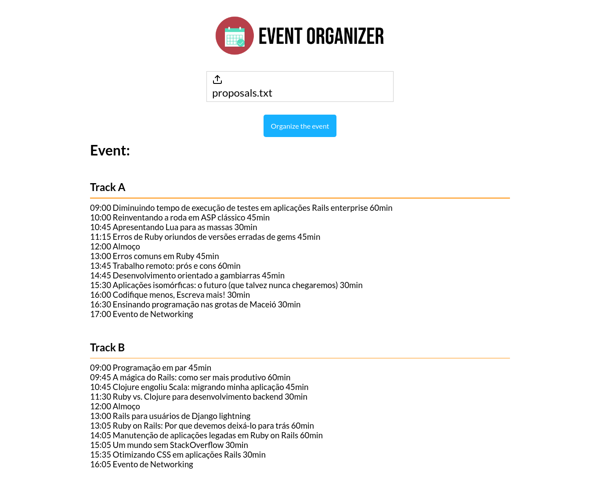

# 📅 [Front-end] Event Organizer 2021

## 📝 Description
This is the front-end of the [Event Organizer 2021 REST API](https://github.com/ruifernandees/event-organizer-2021), that converts a file with lectures and the time of each into an organized JSON with all tracks, sessions and hours.

## 🔗 Project dependencies
- react-dropzone
- axios

## 🚀 Run on your machine

Note: it requires yarn or npm installed 

> Initial steps
```bash
$ git clone https://github.com/ruifernandees/event-organizer-2021-interface.git
$ cd event-organizer-2021-interface
# Install all dependencies
$ yarn install
```

> Run app
```bash
# Start the server
$ yarn start 
```

### Screens
#### Home ('/')
